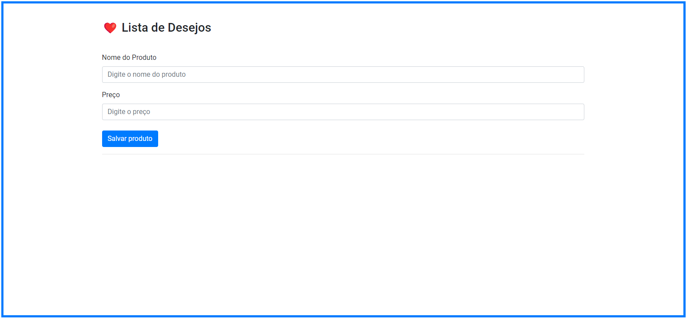
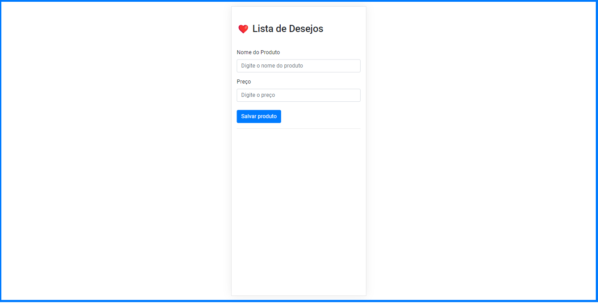

# Angular Wishlist

Angular Wishlist surgiu de um projeto feito no inicío de meus estudos a fins de melhorar minha compreensão sobre a comunicação dos componentes do Angular (Inputs e Outputs).

Agora com um pouco mais de experiência, resolvi aplicar neste projeto conceitos que aprendi neste ultimo ano de estudos.

Todos nós temos algo que desejamos não é mesmo? E nos casos em que o dinheiro pode comprar, por que não adicionar esses pequenos sonhos em uma lista?

Angular Wishlist tem o proposito de adicionar itens, editar, remover ou registrar quando forem conquistados. Uma simples lista de desejos que lhe permitirá visualizar seus objetivos onde quer que você esteja.

## Screenshots

## Stack utilizada

**Front-end:** Angular, Angular Material, Bootstrap

## Rodando localmente

#### Clone o projeto

`git clone https://github.com/GiselleBarbosa/angular-wishlist.git`

#### Instale as dependências

`npm install`

#### Inicie o servidor

`http://localhost:4200/`.
`

#### Execute a aplicação

`npm run start`

## Funcionalidades

- Salvamento de suas anotações em Localstorage
- Crie ou remova produtos
- Marcar como adquirido

## Atenção

Inicialmente, pelo fato do projeto ainda não possui integração com um banco de dados, seus registros serão salvos em localstora, ou seja, na memória de seu navegador, portanto tenha cuidado ao fazer a limpeza do mesmo pois isso causará a perda de suas anotações.

## Melhorias

Em desenvolvimento - refatoração da estrutura global dos componentes.

## Autoria

- [@GiselleBarbosa](https://www.linkedin.com/in/gisellebarb/)

## Licensa

## Referências

- [Angular Material](https://material.angular.io/)
- [Bootstrap](https://getbootstrap.com/)
